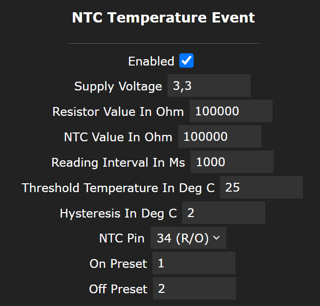
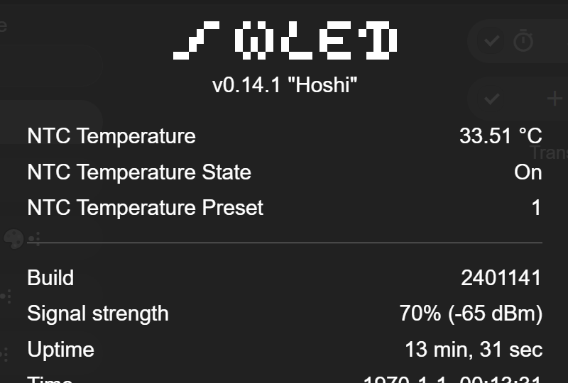

# NTC Temperature Event

Works with ESP32 only!!

This plugin measures the temperature via a NTC resistor like these things are used as a sensor for 3D printers heatbeads.

It's a bit similar to the LDE_Dusk_Dawn_v2 with some differences: 
- The temperature is calculated from ADC value
- ADC has a LUT (look up table) to make it more linear

## Schematic

VCC (3.3V) o---[R1]--o--[NTC]--o GND   
The center pin goes to GPIO (iE GPIO34)

## Screenshots
Usermod config:   

Info:   
